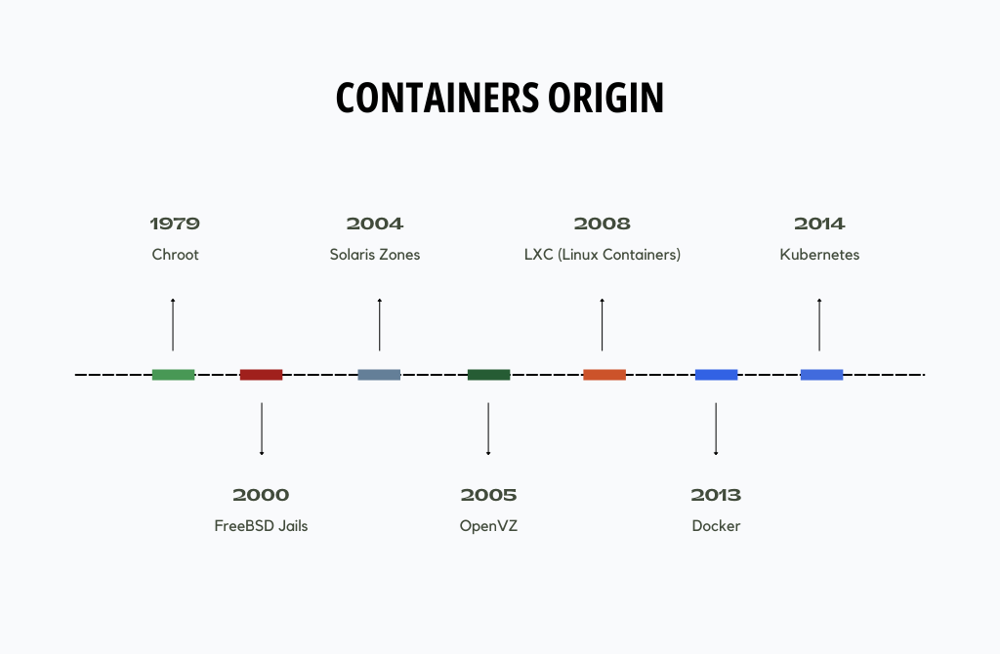

Containers have taken the world of software development and deployment by storm. They have become a fundamental technology for building, packaging, and running applications. Docker, Kubernetes, and other container orchestration platforms have become household names in the tech industry. But what if I told you that containers, at their core, are simply processes running on a Linux system? Let's delve into the heart of containers and explore why they are, fundamentally, just processes on a Linux operating system.

### Brief history of containers

Containers have a rich history that spans multiple operating systems. Here's a brief overview of the evolution of containers on various OSes.



- Chroot - short for "change root," is one of the earliest forms of containment in Unix-like operating systems. It allows a process to have its own isolated root file system.
- FreeBSD Jails - which extended the concept of chroot by adding process and networking isolation.
- Solaris Zones - offered process and file system isolation, as well as resource management features.
- OpenVZ - provided a way to create lightweight virtual environments on a Linux host, sharing the same kernel but isolating user space.
- LXC - userspace interface for the Linux kernel containment features, such as cgroups and namespaces.
- Docker - revolutionized containerization by introducing a user-friendly interface for creating, distributing, and managing containers.
- Kubernetes - now became the de facto standard for managing and orchestrating containers across multiple OSes and cloud platforms.

### Understanding containers

Before we dive into the intricacies of containers, let's establish a common understanding of what containers are and why they are so popular. Containers are a lightweight form of virtualization that packages applications and their dependencies together. This provides isolation, portability, and consistency, streamlining the development, testing, and deployment of software across various environments.

Containers achieve this by using a combination of kernel features, including namespaces and cgroups, to create isolated environments for processes to run. These processes are encapsulated within a container image, which includes the application code, runtime, libraries, and other necessary components. When a container is executed, it runs as an isolated instance of a process, effectively decoupling the application from the underlying infrastructure.

### Containers as processes

Now, let's get to the heart of the matter: containers are just processes running on a Linux system. To understand this better, let's break it down:

1. Isolation with Namespaces: Containers rely on Linux namespaces to provide process-level isolation. Namespaces allow different processes to have their own view of various system resources, such as the file system, network, and process IDs. This isolation ensures that containers do not interfere with each other or with the host system.

- Process IDs(`pid`): Each container has its own process ID (PID) namespace, which means that the processes inside a container have their own isolated view of process IDs.
- Mount(`mnt`): Each container has its own mount points, which means that file and directory mounts are isolated between namespaces.
- Networking(`net`): Containers have their own network namespaces, which means they can have their own network interfaces, IP addresses, and routing tables. This isolation enables containers to communicate independently and securely.

This is three most obvious namespaces for containers. Additionally, there are namespaces like:
- `user` - allow mapping of user and group IDs between the container and host.
- `cgroup` - indeed, cgroups themselves are a namespaced primitive.
- `time` - back to the future.
- `utc` - hostname and NIS domain name.
- `ipc`.

2. File System: Containers use overlay file systems (like UnionFS) to create a layered file system for each container.

3. Resource Management with cgroups: Control groups (cgroups) are another crucial component in container technology. Cgroups allow you to limit and manage the system resources that a container can consume, such as CPU, memory, and I/O. This ensures that containers run within defined resource constraints, just like any other process on the system.

Because containers it's just a process they share the same Linux kernel with the host system. Unlike traditional virtualization technologies like hypervisors, which run multiple guest operating systems on a single host. This shared kernel contributes to the lightweight nature of containers.

### Exploring Linux Namespaces in Action

For this showcase I'll spin up Ubuntu 22.04.3 using Multipass, install `dockre.io` package and start `alpine` container with `sleep 10000` command.

```bash
root@container-is-a-process:~# docker run -d --name sleeper alpine sleep 10000
...
root@container-is-a-process:~# docker ps
CONTAINER ID   IMAGE     COMMAND         CREATED          STATUS          PORTS     NAMES
050d5f790bb2   alpine    "sleep 10000"   5 seconds ago    Up 4 seconds              sleeper
```

Let's check the processes. Currently, Docker uses Containerd as its container runtime. Here is a list of all the processes involved in creating a container:

```bash
root@container-is-a-process:~# ps auxwwf
...
root        2096  0.2  4.3 1196476 42512 ?       Ssl  12:33   0:00 /usr/bin/containerd
root        2371  0.3  7.7 1386936 76836 ?       Ssl  12:33   0:00 /usr/bin/dockerd -H fd:// --containerd=/run/containerd/containerd.sock
root        2640  0.0  1.2 721712 12800 ?        Sl   12:34   0:00 /usr/bin/containerd-shim-runc-v2 -namespace moby -id 050d5f790bb2f310346492db9237d06b1d1819ad20f7a7fb0cf759e7da2b5c8c -address /run/containerd/containerd.sock
root        2661  0.0  0.0   1692     4 ?        Ss   12:34   0:00  \_ sleep 10000
```

Since in Linux, everything has a representation as a file, let's check namespaces for sleeper process.

```bash
root@container-is-a-process:~# ls -l /proc/2661/ns/
total 0
lrwxrwxrwx 1 root root 0 Oct 30 12:36 cgroup -> 'cgroup:[4026532264]'
lrwxrwxrwx 1 root root 0 Oct 30 12:36 ipc -> 'ipc:[4026532205]'
lrwxrwxrwx 1 root root 0 Oct 30 12:36 mnt -> 'mnt:[4026532203]'
lrwxrwxrwx 1 root root 0 Oct 30 12:34 net -> 'net:[4026532207]'
lrwxrwxrwx 1 root root 0 Oct 30 12:36 pid -> 'pid:[4026532206]'
lrwxrwxrwx 1 root root 0 Oct 30 12:36 pid_for_children -> 'pid:[4026532206]'
lrwxrwxrwx 1 root root 0 Oct 30 12:36 time -> 'time:[4026531834]'
lrwxrwxrwx 1 root root 0 Oct 30 12:36 time_for_children -> 'time:[4026531834]'
lrwxrwxrwx 1 root root 0 Oct 30 12:36 user -> 'user:[4026531837]'
lrwxrwxrwx 1 root root 0 Oct 30 12:36 uts -> 'uts:[4026532204]'
```
We can see all available namespace types as a symbolic links to appropriate namespace identifier.

Additionally, we can observe:
- not mentioned earlier `pid_for_children` and `time_for_children` namespaces, so `pid` and `time` namespace for child process could be different from the parent
- monotonically increased IDs for `mnt,utc,ipc,pid,net` can be indication of interrelation

More user friendly approach is to use `lsns`.

```bash
root@container-is-a-process:~# lsns -p 2661
        NS TYPE   NPROCS   PID USER COMMAND
4026531834 time       97     1 root /sbin/init
4026531837 user       97     1 root /sbin/init
4026532203 mnt         1  2661 root sleep 10000
4026532204 uts         1  2661 root sleep 10000
4026532205 ipc         1  2661 root sleep 10000
4026532206 pid         1  2661 root sleep 10000
4026532207 net         1  2661 root sleep 10000
4026532264 cgroup      1  2661 root sleep 10000
```

`NPROCS` shows the number of processes used by a particular namespace. This indicates that all namespaces, except for `time` and `user`, were created specifically for the sleeper process. In case of `time` and `user` namespaces our sleeper shared them with host init process.

Getting all this information could be useful, but how we can interact with already created namespaces? `nsenter` will help us here, it allows us to run command inside existed namespaces.

By default `nsenter` will try to execute current shell inside namespace. But it couldn't exist in container image which with a help of overlay fs mounted as a `root` partition.

```bash
root@container-is-a-process:~# nsenter --all --target 2661
nsenter: failed to execute /bin/bash: No such file or directory
```

Specifying binary that could be found in the image resolves this issue. Following command is equivalent of calling `docker -it exec slepper /bin/sh`. Let's look around.

```bash
root@container-is-a-process:~# nsenter --all --target 2661 /bin/sh
/ # ps aux
PID   USER     TIME  COMMAND
    1 root      0:00 sleep 10000
    7 root      0:00 /bin/sh
    8 root      0:00 ps aux
/ # mount
overlay on / type overlay (rw,relatime,lowerdir=/var/lib/docker/overlay2/l/DIBQTGIBZUYCANWFBRXPZO65HE:/var/lib/docker/overlay2/l/VKGC65UL5HHRVCS2SUXI672RSQ,upperdir=/var/lib/docker/overlay2/5a30f3673504ce50252fdd1219790dd70073d01e8bf5a80eaabb9dfe7c10804c/diff,workdir=/var/lib/docker/overlay2/5a30f3673504ce50252fdd1219790dd70073d01e8bf5a80eaabb9dfe7c10804c/work)
...
/ # ip a
1: lo: <LOOPBACK,UP,LOWER_UP> mtu 65536 qdisc noqueue state UNKNOWN qlen 1000
    link/loopback 00:00:00:00:00:00 brd 00:00:00:00:00:00
    inet 127.0.0.1/8 scope host lo
       valid_lft forever preferred_lft forever
4: eth0@if5: <BROADCAST,MULTICAST,UP,LOWER_UP,M-DOWN> mtu 1500 qdisc noqueue state UP
    link/ether 02:42:ac:11:00:02 brd ff:ff:ff:ff:ff:ff
    inet 172.17.0.2/16 brd 172.17.255.255 scope global eth0
       valid_lft forever preferred_lft forever
/ # tcpdump
/bin/sh: tcpdump: not found
```

The most useful scenario I have found for `nsenter` is using the host filesystem with all its tooling to execute commands that are missing from the container's image. This can be particularly useful with containers running statically linked binaries and built from a `scratch` image.

For example network debugging

```bash
root@container-is-a-process:~# nsenter --net --target 2661
root@container-is-a-process:~# ip a
1: lo: <LOOPBACK,UP,LOWER_UP> mtu 65536 qdisc noqueue state UNKNOWN group default qlen 1000
    link/loopback 00:00:00:00:00:00 brd 00:00:00:00:00:00
    inet 127.0.0.1/8 scope host lo
       valid_lft forever preferred_lft forever
4: eth0@if5: <BROADCAST,MULTICAST,UP,LOWER_UP> mtu 1500 qdisc noqueue state UP group default
    link/ether 02:42:ac:11:00:02 brd ff:ff:ff:ff:ff:ff link-netnsid 0
    inet 172.17.0.2/16 brd 172.17.255.255 scope global eth0
       valid_lft forever preferred_lft forever
root@container-is-a-process:~# ping 1.1.1.1 2>&1 >/dev/null &
[1] 2717
root@container-is-a-process:~# tcpdump -vn -c2 -i eth0
tcpdump: listening on eth0, link-type EN10MB (Ethernet), snapshot length 262144 bytes
12:40:28.647119 IP (tos 0x0, ttl 64, id 20508, offset 0, flags [DF], proto ICMP (1), length 84)
    172.17.0.2 > 1.1.1.1: ICMP echo request, id 1, seq 9, length 64
12:40:28.672272 IP (tos 0x38, ttl 55, id 36996, offset 0, flags [none], proto ICMP (1), length 84)
    1.1.1.1 > 172.17.0.2: ICMP echo reply, id 1, seq 9, length 64
2 packets captured
2 packets received by filter
0 packets dropped by kernel
root@container-is-a-process:~# fg
ping 1.1.1.1 2>&1 > /dev/null
^Croot@container-is-a-process:~#
root@container-is-a-process:~# exit
logout
```

### Black box? I hope not any more

Containers are not some magical black box technology but rather a clever orchestration of existing Linux kernel features. At their core, containers are just processes running on a Linux system, wrapped in layers of abstraction that provide isolation and portability. Understanding this fundamental truth can help developers and operations teams work more effectively with containers and troubleshoot issues with greater insight.

The rise of containerization has undoubtedly revolutionized how we develop and deploy software, making it faster and more reliable. However, it's essential to remember that containers, while powerful, are built on the solid foundation of Linux processes and kernel features.
